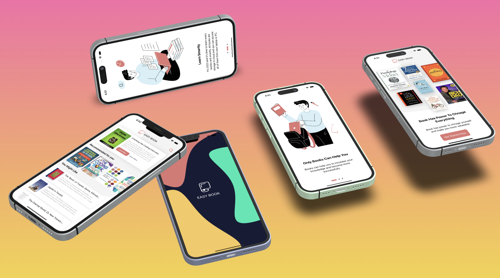

# EasyBook

A native swift application where users can interact with the beautiful user interface, search for any books, recommended books section and the weekly book section aswell. The frontend is 
made using Swift language and the backend of the application is developed using Python django.
For the backend, please refer: [EasyBook Backend](https://github.com/YashMakan/easybook_backend)

## Mockup Design

